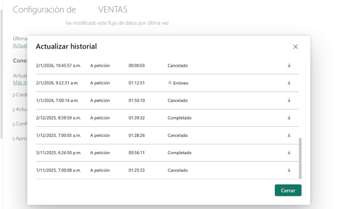
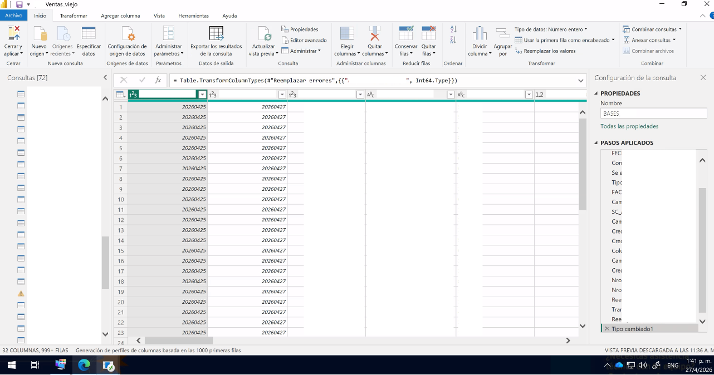

# Power Query → SQL: Migración de Dataflows y Dashboards a Databricks

> Cómo mover la lógica de transformación desde Power Query a SQL en Databricks redujo tiempos de actualización entre un 70% y 97%, eliminó cancelaciones y simplificó la arquitectura de datos del ecosistema de ventas.

---

## Contexto

En entornos de Power BI con alta carga de transformaciones, Power Query (lenguaje M) termina haciendo trabajo pesado para el que no está optimizado: casteos de tipo, joins complejos, columnas calculadas y filtros sobre millones de filas. Cuando además los dataflows se encadenan entre sí y los dashboards dependen de múltiples dataflows como entrada, el resultado es una arquitectura frágil: lenta, difícil de mantener y propensa a cancelaciones en cascada.

La solución fue trasladar toda la lógica de transformación al motor correcto — Databricks — y conectar los dashboards directamente a las tablas del lakehouse, sin pasar por dataflows intermedios.

> **Estos son algunos ejemplos del trabajo realizado. La migración completa abarcó más de 10 dataflows y varios dashboards del área de ventas.**

---

## Resultados

| Componente | Tipo | Antes | Después | Mejora |
|---|---|---|---|---|
| DF_CLIENTES | Dataflow | ~40 min | < 1 min | ↓ 97% |
| DF_VENTAS | Dataflow | >1h + cancelaciones | ~20 min estable | ↓ 70% |
| VENTAS | Dashboard | ~60 min, 7 entradas | ~10 min, 1 conexión | ↓ 83% |

Además de los tiempos, el impacto fue arquitectural:

- Linajes simplificados — de 7 dataflows de entrada a conexión directa con Databricks
- Eliminación de dependencias en cadena entre flujos
- Cero cancelaciones desde la migración
- Modelos semánticos con 1 solo paso en Power Query en lugar de 20+
- Monitoreo automático de procesos críticos vía Power Automate + Teams

---

## Por qué llevar la lógica a SQL en Databricks

### En dataflows

Power Query ejecuta las transformaciones en la capacidad de Power BI. Cuando hay muchos pasos aplicados — casteos, joins, columnas calculadas, reemplazos de nulos — Power BI carga y procesa los datos en su motor, consumiendo capacidad del workspace y generando tiempos de actualización altos.

Al mover esa lógica a SQL ejecutado en Databricks mediante `Value.NativeQuery`, el procesamiento ocurre en el motor analítico de Databricks, que está diseñado y optimizado para exactamente eso. Power BI recibe los datos ya transformados y solo necesita un paso: el origen.

**Ventajas concretas:**
- Databricks escala horizontalmente para procesar grandes volúmenes — Power BI no
- El SQL se ejecuta en el SQL Warehouse de Databricks, sin consumir capacidad del workspace de Power BI
- Menos pasos en Power Query = menor complejidad de mantenimiento
- Las transformaciones quedan en SQL, más legibles y auditables que cadenas de pasos M
- `Value.NativeQuery` habilita query folding total: la transformación se ejecuta en el origen
- Elimina la necesidad de crear vistas o tablas intermedias solo para exponer datos a Power BI

### En dashboards

Cuando un modelo semántico depende de múltiples dataflows como entrada, cada actualización requiere que todos esos dataflows terminen antes. Si uno falla, el modelo queda desactualizado. Además, cada capa de la cadena consume capacidad de Power BI ejecutando sus propias transformaciones.

Al conectar el modelo semántico directamente a las tablas del lakehouse en Databricks, se elimina esa cadena. El modelo lee directo de la fuente de verdad.

**Ventajas concretas:**
- Sin dependencias entre dataflows — el modelo actualiza en cuanto las tablas de Databricks están disponibles
- Un fallo en un proceso upstream no cancela el dashboard
- Linaje simplificado: fácil de entender, auditar y mantener
- Tiempos menores porque no hay capas intermedias de procesamiento
- Arquitectura más limpia: Databricks como capa de procesamiento, Power BI como capa de consumo

---

## El principio central

```
Power BI consume. Databricks procesa.
```

Cada motor haciendo lo que mejor sabe hacer.

---

## Caso 1 — DF_CLIENTES (Dataflow)

**Antes:** ejecuciones programadas de entre 30 y 48 minutos, con 20+ pasos aplicados en Power Query.  
**Después:** actualizaciones completadas en segundos, con un único paso — `Value.NativeQuery` contra Databricks.

### Historial de actualización

**Antes (~30–48 min por ejecución):**


**Después (segundos):**


### Traducción de Power Query a SQL

**Antes — múltiples pasos M:**
```m
let
    origen = ...,
    tipo_cambiado = Table.TransformColumnTypes(
        origen,
        {{"id_cliente", Int64.Type}, {"nombre", type text}}
    ),
    filas_filtradas = Table.SelectRows(
        tipo_cambiado,
        each [activo] = true
    ),
    nulos_reemplazados = Table.ReplaceValue(
        filas_filtradas, null, "N/A",
        Replacer.ReplaceValue, {"region"}
    )
    // ... 15+ pasos más
in
    nulos_reemplazados
```

**Después — 1 paso, SQL en Databricks:**
```m
let
    origen = Databricks.Catalogs(
        "adb-xxx.azuredatabricks.net",
        "/sql/1.0/warehouses/xxx"
    ),
    resultado = Value.NativeQuery(
        origen,
        "
        SELECT
            CAST(id_cliente AS INT),
            nombre,
            COALESCE(region, 'N/A') AS region,
            activo
        FROM catalog.schema.dim_clientes
        WHERE activo = 1
        "
    )
in
    resultado
```

---

## Caso 2 — DF_VENTAS (Dataflow)

**Antes:** historial con cancelaciones frecuentes, ejecuciones erróneas y tiempos superiores a 1 hora. El flujo dependía de 3 dataflows previos — si alguno fallaba, este se cancelaba en cascada.  
**Después:** ejecuciones estables de 18–25 minutos, sin dependencias externas.

### Historial de actualización

**Antes — cancelaciones y errores:**



**Después — ejecución estable:**


### Antes — dependencias en cadena
```
DF_VENTAS_ACTUAL  ──┐
DF_VENTAS_HIST   ───┼──► DF_VENTAS  ← si alguno falla, este se cancela
DF_VENTAS_ID     ──┘
```

### Después — flujo independiente con SQL directo
```sql
SELECT
    v.id,
    v.fecha_venta,
    v.cantidad,
    v.precio_unitario,
    v.cantidad * v.precio_unitario AS total_venta
FROM fact_ventas v
WHERE v.anio_mes >= 202401
```

---

## Caso 3 — VENTAS (Dashboard)

Este es el caso más completo: combina la refactorización de Power Query con la eliminación de las dependencias de dataflows en el modelo semántico.

**Antes:** el modelo dependía de 7 dataflows como entrada (incluyendo orígenes en SharePoint), tenía 72 consultas en Power Query con múltiples pasos aplicados por tabla, y tardaba ~60 minutos en actualizarse.  
**Después:** conexión directa a Databricks via `Value.NativeQuery`, 33 consultas, 1 solo paso por tabla, actualización en ~10 minutos.

### Power Query — antes y después

**Antes — 72 consultas, 20+ pasos por tabla:**



**Después — 33 consultas, 1 paso (Origen):**


### Linaje — antes y después

**Antes — 7 dataflows de entrada:**


**Después — conexión directa a Databricks:**


### Lo que cambió en Power Query

**Antes — decenas de pasos por tabla:**
```m
// BASES — pasos aplicados (fragmento):
// Paso 1
// Paso 2
// Paso 3
// Paso 4
// Paso 5
// Paso 6
// Paso 7
// Paso 8
// Paso 9
// Paso 10
// Paso 11
// Paso 12
// ... y varios pasos más

= Table.TransformColumnTypes(
    #"Paso anterior",
    {{"columna", Int64.Type}}
)
// Cada tabla del modelo tenía su propia cadena de pasos.
// En total: 72 consultas, cada una con su propio stack de transformaciones.
```

**Después — 1 paso por tabla:**
```m
// BASES — pasos aplicados:
// Origen  ← único paso

= Value.NativeQuery(
    Databricks.Catalogs(
        "adb-xxx.azuredatabricks.net",
        "/sql/1.0/warehouses/"
    ),
    "
    Consulta SQL aquí...
    "
)
// Toda la lógica vive en SQL dentro de Databricks.
// Power Query solo conecta y trae el resultado.
```

---

## Traducciones M → SQL más comunes

Las operaciones que más aparecen al migrar de Power Query a SQL:

### Cambio de tipo de datos
```m
-- Power Query (M):
Table.TransformColumnTypes(tabla, {{"precio", type number}})
```
```sql
-- SQL Databricks:
CAST(precio AS DECIMAL(10,2))
-- o en dialecto Databricks:
precio::DECIMAL(10,2)
```

### Filtrado de filas
```m
-- Power Query (M):
Table.SelectRows(tabla, each [estado] = "Activo")
```
```sql
-- SQL Databricks:
WHERE estado = 'Activo'
```

### Columna calculada
```m
-- Power Query (M):
Table.AddColumn(tabla, "total", each [cantidad] * [precio])
```
```sql
-- SQL Databricks:
SELECT *, cantidad * precio AS total FROM tabla
```

### Reemplazar nulos
```m
-- Power Query (M):
Table.ReplaceValue(tabla, null, "N/A", Replacer.ReplaceValue, {"region"})
```
```sql
-- SQL Databricks:
COALESCE(region, 'N/A') AS region
```

### Join entre tablas
```m
-- Power Query (M):
Table.NestedJoin(ventas, {"id"}, clientes, {"id"}, "tmp", JoinKind.Left)
-- + Table.ExpandTableColumn(...)
```
```sql
-- SQL Databricks:
SELECT v.*, c.nombre_cliente
FROM fact_ventas v
LEFT JOIN dim_clientes c ON v.id_cliente = c.id
```

---

## Monitoreo: alertas automáticas con Power Automate y Teams

Como complemento operativo se implementó un flujo en Power Automate que se activa al finalizar la actualización de un dataflow o modelo semántico, evalúa el estado y envía un mensaje al canal de Teams con workspace, nombre del componente, estado, hora de inicio y hora de fin.

Esto eliminó la necesidad de revisar manualmente el historial de actualización de cada componente.

```
✅ DATAFLOW UPDATE OK :)
Workspace: PRODUCTION
Dataflow:  DF_VENTAS
Estado:    Success
Inicio:    27/04/2026 07:03
Fin:       27/04/2026 07:25
```

---

## Stack utilizado

- **Power BI Service** — consumo, modelado semántico y visualización
- **Databricks (Azure)** — transformaciones SQL, almacenamiento analítico (lakehouse)
- **Power Query M** — reducido a conexión + `Value.NativeQuery`
- **Power Automate** — alertas automáticas en Microsoft Teams
- **Git / YAML / Airflow** — control de versiones y orquestación de pipelines de ingesta

---

## Aprendizajes

**1. No traduzcas línea por línea.** M y SQL piensan diferente. M es secuencial; SQL es declarativo sobre conjuntos. Replanteá la lógica completa, no copies pasos.

**2. `Value.NativeQuery` es el puente.** Permite ejecutar SQL arbitrario contra Databricks desde Power Query. El resultado llega ya procesado — Power BI no hace ninguna transformación adicional.

**3. Empezá por los más lentos.** El impacto es inmediato y justifica el esfuerzo ante la jefatura.

**4. Documentá el linaje antes de migrar.** Entender de qué depende cada flujo evita romper cosas en cascada.

**5. El beneficio no es solo velocidad.** Simplicidad de mantenimiento, menos puntos de falla y mayor estabilidad operativa son igual de valiosos.

**6. Conectar dashboards directo a Databricks rompe la cadena de dependencias.** Cuando el modelo semántico lee directo del lakehouse, un fallo en un dataflow upstream no lo afecta. Cada componente es independiente.

---

## Autor

**Ing. Mathias Ortiz** 
[LinkedIn](https://www.linkedin.com/in/mathiasortiz) · [GitHub](https://github.com/MathiasOrtiz)

---

*Los nombres de componentes fueron modificados para no exponer información interna. Este README documenta una migración realizada en abril de 2026.*
